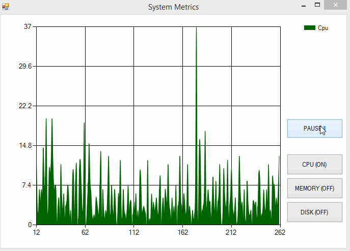
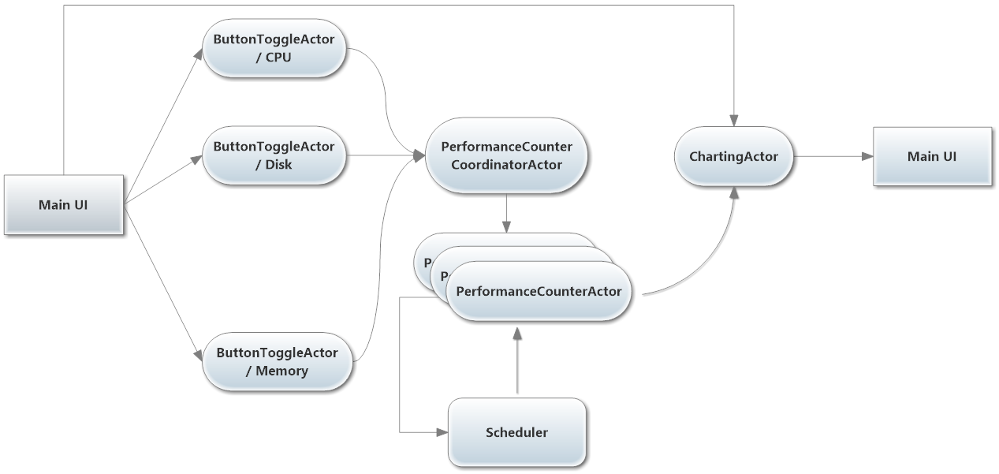

# SystemCharting

Modified sample from [Unit 2](https://github.com/petabridge/akka-bootcamp/tree/master/src/Unit-2) of [Akka.NET Bootcamp](https://github.com/petabridge/akka-bootcamp)

Here's what the final output from the application looks like::

A high-level overview of working system:

*Images from [Akka.NET Bootcamp](https://github.com/petabridge/akka-bootcamp)*