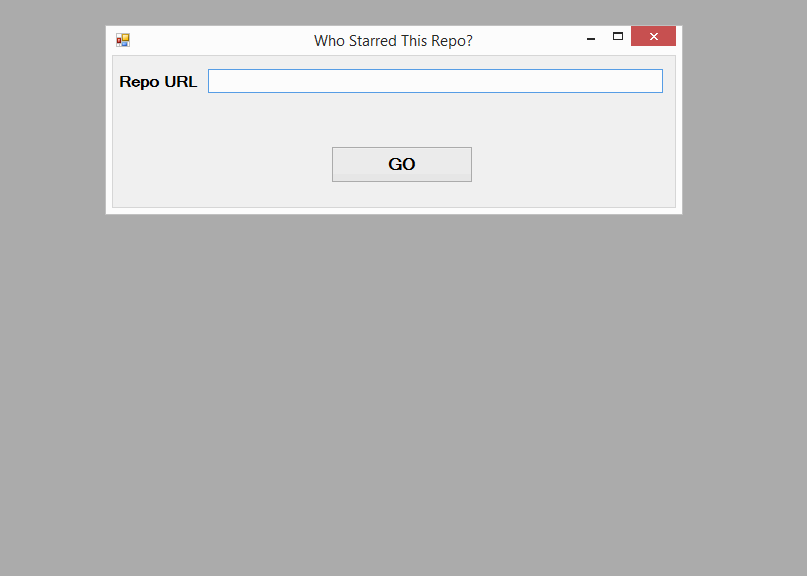
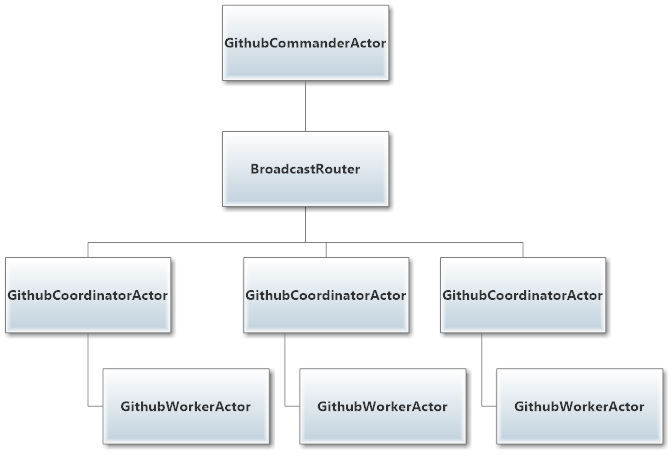

# GithubActors

Modified sample from [Unit 3](https://github.com/petabridge/akka-bootcamp/tree/master/src/Unit-3) of [Akka.NET Bootcamp](https://github.com/petabridge/akka-bootcamp)

Here's what the final output from the application looks like::

The actor hierarchy for GithubActors:
